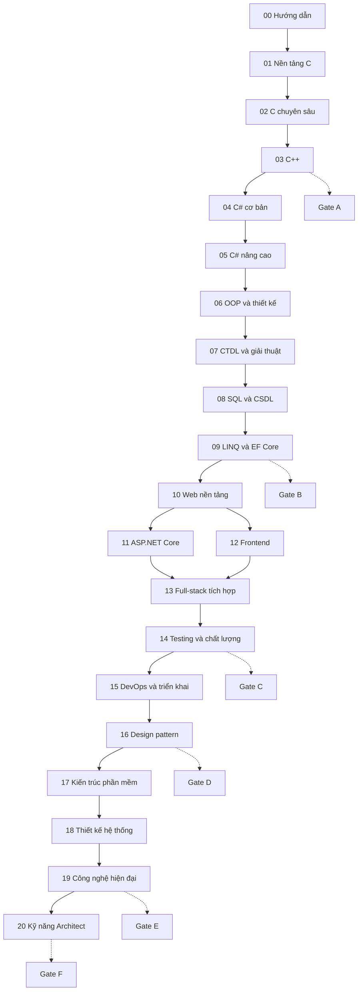

# Lộ trình Full-stack từ số 0 đến Software Architect

## 1. Cách dùng roadmap

Lộ trình biên soạn và tuyến học mặc định đi theo thứ tự module `00 → 20`. Module `21-du-an-thuc-hanh` là kho project checkpoint: người học thực hiện project tương ứng ngay khi đủ prerequisite, không cần đợi học hết module `20`.

Hoàn thành tài liệu có nghĩa là đã xây dựng nền tảng kiến thức và portfolio thực hành. Chức danh Senior hoặc Software Architect còn cần kinh nghiệm sở hữu hệ thống production, xử lý incident, làm việc với stakeholder và chịu trách nhiệm cho trade-off thực tế.

## 2. Giả định ước lượng

- Nhịp chuẩn: `12–15 giờ/tuần`, khoảng `48 tuần học/năm`.
- “Giờ học” gồm đọc, tự gõ code, debug, làm bài tập, ôn tập và project; không phải chỉ xem nội dung.
- Ước lượng đã gồm checkpoint nhưng chưa thể thay thế số năm kinh nghiệm làm việc.
- Baseline kỹ thuật theo yêu cầu của bộ tài liệu: C11, C++20 và project .NET target `net9.0`. Exact SDK/compiler/package sẽ được pin trong bài môi trường và project.
- Người đã có nền tảng có thể làm bài đánh giá và rút ngắn module, nhưng không bỏ qua project gate.

| Nhịp học | Thời gian dự kiến cho toàn lộ trình |
|---|---:|
| 8 giờ/tuần | khoảng 6–9 năm |
| 12 giờ/tuần | khoảng 4,5–6 năm |
| 15 giờ/tuần | khoảng 3,5–5 năm |
| 20 giờ/tuần | khoảng 2,5–4 năm |

Tổng khối lượng dự kiến là `2.500–3.600 giờ`. Đây là khoảng ước lượng, không phải cam kết thời gian đạt chức danh.

## 3. Tổng quan 5 cấp

| Cấp | Module trọng tâm | Sản phẩm đầu ra | Khối lượng | Ở 12–15 giờ/tuần |
|---|---|---|---:|---:|
| Người mới | `00–03` | Chương trình C/C++ nhiều file; giải thích đúng memory/ownership/RAII | 300–420 giờ | 5–8 tháng |
| Junior | `04–14` | Ứng dụng full-stack `.NET + SQL + React` có auth và test | 1.000–1.400 giờ | 16–27 tháng |
| Middle | `15–16` | Ứng dụng containerized, CI/CD và refactor có chủ đích | 300–450 giờ | 5–9 tháng |
| Senior | `17–19` | Hệ thống phân tán có resilience, messaging và observability | 600–850 giờ | 9–16 tháng |
| Architect | `20` + capstone `21` | Hồ sơ kiến trúc gồm C4, ADR, threat model, PoC và migration plan | 300–450 giờ | 5–9 tháng |

## 4. Sơ đồ thứ tự và phụ thuộc

Tuyến biên soạn vẫn là tuần tự theo số module. Nhánh `11` và `12` trong sơ đồ cho biết về mặt kiến thức, frontend và backend cùng phụ thuộc web nền tảng; người tự học vẫn nên học `11` trước `12` để bám đúng thứ tự tài liệu.

| Module | Prerequisite bắt buộc |
|---|---|
| `01` | `00` |
| `02` | `01` |
| `03` | `01–02` |
| `04` | `01`; nên hoàn thành `03` để so sánh memory/RAII |
| `05` | `04` |
| `06` | `04–05` |
| `07` | `01`, `04` |
| `08` | `01`; kỹ năng lập trình căn bản |
| `09` | `04–05`, `08` |
| `10` | `04`; kiến thức terminal/network trong `00` |
| `11` | `05`, `09–10` |
| `12` | `01`, `10` |
| `13` | `09`, `11–12` |
| `14` | `11`, `13` |
| `15` | `13–14` |
| `16` | `06`, `11`, `14` |
| `17` | `06`, `09`, `11`, `14`, `16` |
| `18` | `07–09`, `15`, `17` |
| `19` | `10–11`, `15`, `17–18` |
| `20` | `15`, `17–19` |
| `21` | Ghi riêng trong từng project; thực hiện theo Gate A–F |

## 5. Cấp 1 — Người mới

### Thứ tự

`00-huong-dan → 01-nen-tang-lap-trinh → 02-c-chuyen-sau → 03-cpp → Gate A`

### Trọng tâm

- Dùng terminal, editor/IDE, compiler, debugger và Git ở mức cơ bản.
- Biến bài toán thành luồng lệnh, hàm và cấu trúc dữ liệu đơn giản bằng C.
- Theo dõi chính xác địa chỉ, pointer, stack frame, heap allocation và lifetime.
- Quản lý tài nguyên thủ công trong C, sau đó đối chiếu với RAII và smart pointer trong C++.

### Gate A

Xây dựng ứng dụng console C lưu dữ liệu vào file và một phiên bản C++ quản lý tài nguyên bằng RAII.

Chỉ qua Gate A khi người học:

- Tự build/debug được chương trình nhiều file trên môi trường sạch.
- Vẽ được stack/heap cho biến cục bộ, pointer và object cấp phát động.
- Chỉ rõ mỗi lần `malloc` hoặc `new` tạo vùng nhớ nào, pointer/reference nào giữ địa chỉ và khi nào tài nguyên được giải phóng.
- Dùng công cụ phát hiện và loại bỏ memory leak, use-after-free, double free.
- Giải thích được khác biệt giữa manual ownership và RAII.

## 6. Cấp 2 — Junior Full-stack Developer

### Thứ tự

`04 → 05 → 06 → 07 → 08 → 09 → 10 → 11 → 12 → 13 → 14`, thực hiện Gate B sau `09` và Gate C sau `14`.

### Trọng tâm

- C# từ cú pháp đến generics, async/await, nullable, reflection và performance.
- OOP/SOLID, cấu trúc dữ liệu và tư duy chọn độ phức tạp phù hợp.
- SQL trước, LINQ/EF Core sau; đọc query plan và xử lý N+1.
- HTTP, REST, identity, OWASP, ASP.NET Core, React và tích hợp end-to-end.
- Unit/integration/end-to-end test và code review.

### Gate B và Gate C

- **Gate B:** ứng dụng C# dùng SQL và EF Core, có migration, transaction, optimistic concurrency và truy vấn được đo/giải thích bằng execution plan.
- **Gate C:** ứng dụng CRUD full-stack có authentication, authorization, validation, structured logging và test cho critical path.

Chỉ hoàn thành cấp Junior khi người học:

- Giải thích object nào nằm trên heap, biến nào chứa value/reference và điều gì xảy ra ở mỗi lần `new`.
- Viết được SQL trực tiếp trước khi biểu diễn cùng truy vấn bằng LINQ/EF Core.
- Phát hiện N+1, multiple enumeration, query lấy thừa dữ liệu và index không phù hợp.
- Theo dõi được một request từ browser qua middleware, application, EF Core, database rồi trở về.
- Clone repository vào môi trường sạch và chạy toàn hệ thống chỉ theo README.

## 7. Cấp 3 — Middle Developer

### Thứ tự

`15-devops-trien-khai → 16-design-pattern → Gate D`

### Trọng tâm

- Git workflow, container, CI/CD, cấu hình, secret, deployment và monitoring.
- Chọn design pattern từ force/trade-off của bài toán, không chọn theo tên quen thuộc.
- Vận hành thay đổi từ commit đến production và chuẩn bị rollback.

### Gate D

Chuyển project full-stack thành modular monolith có Docker, pipeline build/test/deploy, health check, telemetry và runbook.

Người học phải debug được lỗi configuration/network/container, giải thích chi phí của pattern đã chọn và thực hiện rollback theo tài liệu.

## 8. Cấp 4 — Senior Developer

### Thứ tự

`17-kien-truc-phan-mem → 18-thiet-ke-he-thong → 19-cong-nghe-hien-dai → Gate E`

### Trọng tâm

- Quality attributes, DDD, CQRS, modular monolith, microservices và event-driven architecture.
- Capacity estimation, caching, load balancing, database scaling, CAP/PACELC và failure mode.
- Cloud, Kubernetes, Redis, RabbitMQ/Kafka, API gateway và OpenTelemetry.

### Gate E

Thiết kế và chạy một hệ thống event-driven nhiều service có cache, message broker, tracing, retry, idempotency, dead-letter handling và kịch bản failure injection.

Chỉ hoàn thành cấp Senior khi người học:

- Bắt đầu từ requirement/constraint/quality attribute, không bắt đầu từ tên công nghệ.
- Chứng minh được khi nào modular monolith tốt hơn microservices.
- Thiết kế timeout, retry, circuit breaker, idempotency, outbox/inbox và dead-letter flow.
- Dùng load test, metrics, logs và traces để xác định bottleneck.
- Phân tích nhất quán trade-off giữa consistency, availability, latency, complexity và cost.

## 9. Cấp 5 — Software Architect

### Thứ tự

`20-ky-nang-architect → Gate F`

### Trọng tâm

- Khai thác yêu cầu và quality attribute scenario từ stakeholder.
- So sánh phương án bằng trade-off, viết ADR và kiểm chứng rủi ro bằng PoC.
- Giao tiếp kiến trúc bằng C4/UML đúng mức chi tiết cho từng audience.
- Lập kế hoạch security, compliance, cost, evolution, migration và operations.
- Review thiết kế, mentoring và điều phối quyết định giữa nhiều team.

### Gate F

Architecture capstone phải có requirement, capacity estimate, C4, ADR, data/API contracts, threat model, deployment view, observability plan, migration/rollback plan, PoC và buổi tự bảo vệ quyết định.

Mọi quyết định lớn phải truy ngược về requirement hoặc constraint; mỗi quyết định quan trọng phải có ít nhất hai phương án thay thế và trade-off cụ thể.

## 10. Vòng lặp học cho mỗi bài

1. Đọc bài toán mở đầu và tự đề xuất hướng giải trước khi xem code.
2. Tự gõ, build và chạy code; không chỉ sao chép.
3. Dùng debugger quan sát state, call stack và memory khi phù hợp.
4. Thay đổi input, cố tình gây lỗi rồi giải thích kết quả.
5. Làm bài tập từ dễ đến khó mà không xem lời giải đầy đủ.
6. Commit code cùng ghi chú về bug, quyết định và điều đã học.
7. Ôn lại sau 1 ngày, 1 tuần và 1 tháng.

## 11. Điều kiện chuyển cấp

- Hoàn thành tối thiểu 80% bài tập cốt lõi và toàn bộ bài bắt buộc.
- Project gate chạy được trên một môi trường sạch bằng lệnh ghi trong README.
- Có thể giải thích cơ chế qua code/sơ đồ, không chỉ nhắc lại định nghĩa.
- Tự tái hiện, chẩn đoán và sửa lỗi phổ biến của cấp hiện tại.
- Project có test, tài liệu giới hạn hiện tại và quyết định kỹ thuật chính.
- Sau Gate C có thể bắt đầu chuẩn bị hồ sơ Junior; các mốc Middle/Senior/Architect vẫn cần kinh nghiệm thực tế tương ứng với phạm vi trách nhiệm.

## 12. Cách theo dõi

Xem [PROGRESS.md](../PROGRESS.md). Checkbox chỉ được chuyển sang `[x]` khi bài đã đủ cấu trúc, code đã kiểm tra và cross-link prerequisite/next hợp lệ.
