---
hide:
  - navigation
  - toc
---

  

     Bộ Tài Liệu Tự Học Toàn Diện 2026
  

  <h1 class="hero-title">Full-stack: Từ Số 0 Đến Software Architect</h1>
  
Bộ tài liệu tự học lập trình toàn diện bằng tiếng Việt. Lấy C làm nền tảng bộ nhớ & tư duy, C# / .NET 9 làm công nghệ thực chiến đi làm, C++20 hiểu sâu OOP & RAII, tiến tới Web, Microservices & Thiết kế hệ thống.

  

    <a href="00-huong-dan/roadmap.md" class="btn-hero btn-hero-primary">🚀 Khám Phá Roadmap 5 Cấp</a>
    <a href="01-nen-tang-lap-trinh/01-bai-toan-thuat-toan-va-pseudocode.md" class="btn-hero btn-hero-secondary">💻 Bắt Đầu Học Module 01</a>
    <a href="PROGRESS.md" class="btn-hero btn-hero-secondary">📈 Xem Tiến Độ Chương Trình</a>
  

  

    
22

    
Module Kiến Thức

  

  

    
137+

    
Bài Học Chuyên Sâu

  

  

    
.NET 9

    
Target SDK Mới Nhất

  

  

    
100%

    
Code Chạy Tái Tạo Được

  

---

## 🧭 Các Module Đã Hoàn Thành (Sẵn Sàng Học)

-   :material-map-legend:{ .card-icon }
    
    ### Module 00: Hướng Dẫn & Lộ Trình
    Tổng quan
    
    Roadmap 5 cấp độ từ Intern đến Architect, quy chuẩn môi trường làm việc và phương pháp học lập trình hiệu quả.
    
    [:octicons-arrow-right-24: Đọc hướng dẫn](00-huong-dan/roadmap.md)

-   :material-language-c:{ .card-icon }
    
    ### Module 01: Nền Tảng Lập Trình Với C
    15 Bài • Hoàn thành
    
    Biến, kiểu dữ liệu, toán tử, cấu trúc điều khiển, hàm, mảng, chuỗi và tư duy thuật toán cơ bản bằng ngôn ngữ C.
    
    [:octicons-arrow-right-24: Học Module 01](01-nen-tang-lap-trinh/01-bai-toan-thuat-toan-va-pseudocode.md)

-   :material-memory:{ .card-icon }
    
    ### Module 02: C Chuyên Sâu & Mô Hình Bộ Nhớ
    15 Bài • Hoàn thành
    
    Con trỏ (pointer), Stack vs Heap, cấp phát động, Struct/Union, Bitwise, C nhiều file và thao tác File I/O.
    
    [:octicons-arrow-right-24: Học Module 02](02-c-chuyen-sau/01-dia-chi-bo-nho-va-con-tro.md)

-   :material-language-cpp:{ .card-icon }
    
    ### Module 03: C++20 & Hướng Đối Tượng
    14 Bài • Hoàn thành
    
    OOP căn bản & nâng cao, STL, Smart Pointers, Move Semantics, RAII và các tính năng hiện đại trong C++20.
    
    [:octicons-arrow-right-24: Học Module 03](03-cpp/01-tu-c-sang-cpp20.md)

-   :material-language-csharp:{ .card-icon }
    
    ### Module 04: C# Cơ Bản & Hệ Sinh Thái .NET
    16 Bài • Hoàn thành
    
    Value vs Reference types, Garbage Collector, Generics, Collections, Exception handling và LINQ căn bản với .NET 9.
    
    [:octicons-arrow-right-24: Học Module 04](04-csharp-co-ban/01-dotnet-9-va-chuong-trinh-csharp.md)

-   :material-lightning-bolt:{ .card-icon }
    
    ### Module 05: C# Nâng Cao & Hiệu Năng Cao
    19 Bài • Hoàn thành
    
    `Span<T>`, `Memory<T>`, Async/Await, Threading, Reflection, Expression Trees, Performance optimization và Memory profiling.
    
    [:octicons-arrow-right-24: Học Module 05](05-csharp-nang-cao/01-generics-va-constraints.md)

-   :material-shape-outline:{ .card-icon }
    
    ### Module 06: OOP & Thiết Kế Phần Mềm
    14 Bài • Hoàn thành
    
    OOP căn bản, SOLID (SRP, OCP, LSP, ISP, DIP), Coupling & Cohesion, Dependency Injection, Clean Code và Refactoring thực chiến.
    
    [:octicons-arrow-right-24: Học Module 06](06-oop-va-thiet-ke/01-mo-hinh-hoa-doi-tuong.md)

-   :material-source-branch:{ .card-icon }
    
    ### Module 07: Cấu Trúc Dữ Liệu & Giải Thuật
    19 Bài • Hoàn thành
    
    Big-O, array, linked list, hash table, tree, heap, graph, BFS/DFS, Dijkstra, sorting, greedy, backtracking, dynamic programming và Route Engine.
    
    [:octicons-arrow-right-24: Học Module 07](07-cau-truc-du-lieu-giai-thuat/01-big-o-thoi-gian-va-bo-nho.md)

-   :material-database:{ .card-icon }
    
    ### Module 08: SQL & Cơ Sở Dữ Liệu
    25 Bài • Hoàn thành
    
    Mô hình quan hệ, CRUD, JOIN, CTE, window function, chuẩn hóa, index, transaction, isolation, execution plan, security, backup/migration và capstone CSDL thương mại điện tử.
    
    [:octicons-arrow-right-24: Học Module 08](08-sql-va-csdl/01-mo-hinh-quan-he-va-cai-dat-sql-server.md)

---

## 🎯 Lộ Trình Phát Triển Tiếp Theo

```mermaid
graph LR
    A[Module 01-02: C & Bộ nhớ] --> B[Module 03: C++20 & OOP]
    B --> C[Module 04-05: C# & .NET 9]
    C --> D[Module 06: OOP & SOLID]
    D --> E[Module 07: CTDL & Giải thuật]
    E --> F[Module 08: SQL & Database]
    F --> G[Module 09: LINQ & EF Core]
    G --> H[Module 10-13: Full-stack Web & React/Angular]
    H --> I[Module 14-15: DevOps & Docker]
    I --> J[Module 16-20: System Design & Architect]
```

### 📦 Các Module Đang Biên Soạn

| Module | Chủ đề chính | Trạng thái |
|---|---|---|
| **09** | LINQ & Entity Framework Core | Đang lên kế hoạch |
| **10-13** | Web Foundation, ASP.NET Core & React/Angular | Đang lên kế hoạch |
| **14-15** | Testing, CI/CD, Docker & DevOps | Đang lên kế hoạch |
| **16-20** | Design Patterns, Microservices & System Design | Đang lên kế hoạch |

---

## 🧩 Hai Lựa Chọn Frontend

Sau phần nền tảng chung **HTML → CSS → JavaScript → TypeScript**, người học chọn **một** framework để đi tiếp:

| Nhánh | Trọng tâm | Kết nối backend |
|---|---|---|
| **React** | JSX, hooks, React Router, Context/Reducer, TanStack Query | ASP.NET Core API |
| **Angular** | Standalone Components, DI, RxJS, Reactive Forms, Router, HttpClient, Signals | ASP.NET Core API |

Cả hai nhánh quay lại cùng Module 13 để học authentication, validation end-to-end, upload/download, realtime, Docker và triển khai full-stack. Không bắt buộc học cả React và Angular.

---

## 💡 Phương Pháp Học "Problem-First"

Mỗi bài học trong bộ tài liệu được thiết kế theo tiêu chuẩn 8 phần nghiêm ngặt:

1. **Mục tiêu bài học:** Xác định rõ kiến thức cần đạt.
2. **Bài toán mở đầu:** Đặt ra bài toán thực tế cần giải quyết.
3. **Lời giải code hoàn chỉnh:** Đã chạy thử nghiệm với comment chi tiết.
4. **Giải thích cơ chế:** Sơ đồ bộ nhớ / luồng thực thi rõ ràng.
5. **Kiến thức nền:** Đầy đủ lý thuyết trọng tâm.
6. **Lỗi thường gặp:** Cách phòng tránh và debug các bẫy hay gặp.
7. **Bài tập tự luyện:** 3–5 bài tập củng cố kiến thức.
8. **Checklist tự đánh giá:** Đảm bảo nắm vững bài học trước khi chuyển tiếp.
